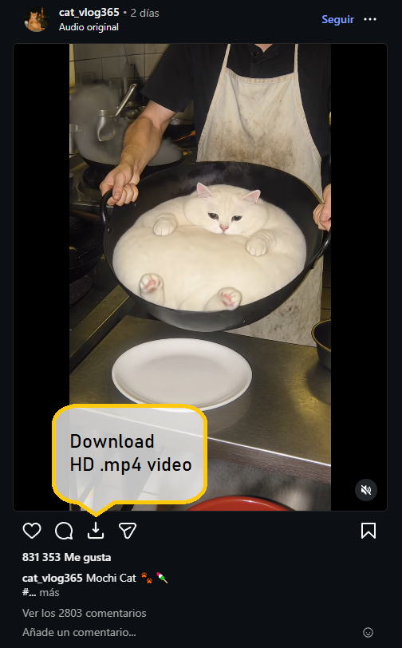

# Instagram HD Video Downloader (Manifest V3)

A minimal Chromium browser extension for downloading Instagram videos in the highest quality available, with automatic FFmpeg merging of video and audio tracks.



## Features

-   **HD Video Downloads**: Automatically downloads the highest quality video available.
-   **FFmpeg Integration**: Merges separate video and audio tracks in the browser using WebAssembly.
-   **Simple UI**: Download button appears next to share button on posts.
-   **Options Popup**: Manage settings and enable/disable the extension easily.
-   **Works Everywhere**: Timeline posts, detail pages, reels, and modals.
-   **Locale-Independent**: Works with Instagram in any language.

## Technical Details

-   **Manifest V3**: Fully compliant with the latest Chrome extension standards.
-   **FFmpeg.wasm**: Video/audio merging happens entirely in the browser (using Offscreen API).
-   **Native Modules**: Built with native ES modules (no complex bundlers).
-   **TypeScript**: Fully typed codebase.

## Installation

### Build from Source

```bash
npm install
npm run build
```

The extension will be built to `zip/chrome/`.

### Load in Browser

**Chrome / Edge / Brave:**

1.  Go to `chrome://extensions/`
2.  Enable **"Developer mode"** (top right)
3.  Click **"Load unpacked"**
4.  Select the `dist` folder or unzip `zip/chrome/`.

## Project Structure

```
src/
├── ts/
│   ├── components/       # UI components (Alerts)
│   ├── downloaders/      # Core download logic
│   ├── helper-classes/   # FFmpeg merger
│   ├── offscreen/        # Offscreen document for FFmpeg
│   ├── options/          # Options popup logic
│   └── models/           # Interfaces
├── css/                  # Styles
├── offscreen/            # Offscreen HTML
├── options/              # Options HTML
└── manifest_chrome.json  # V3 Manifest
```

## Browser Compatibility

-   **Google Chrome** (Manifest V3)
-   **Microsoft Edge**
-   **Brave Browser**
